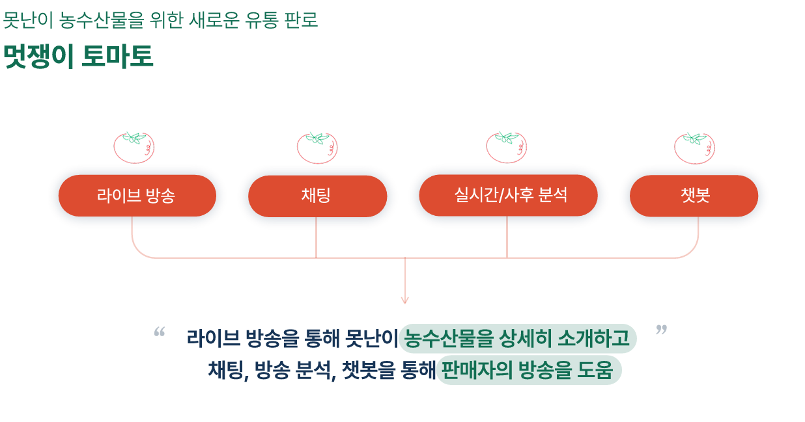
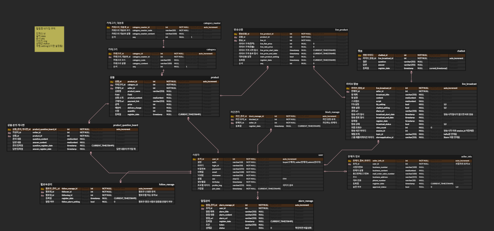
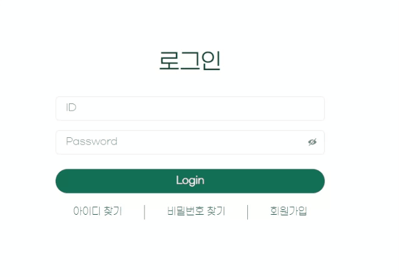
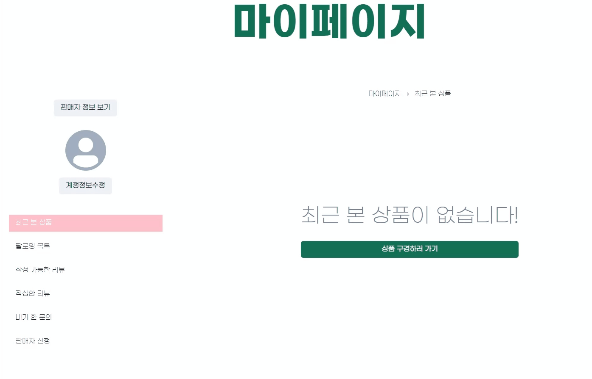
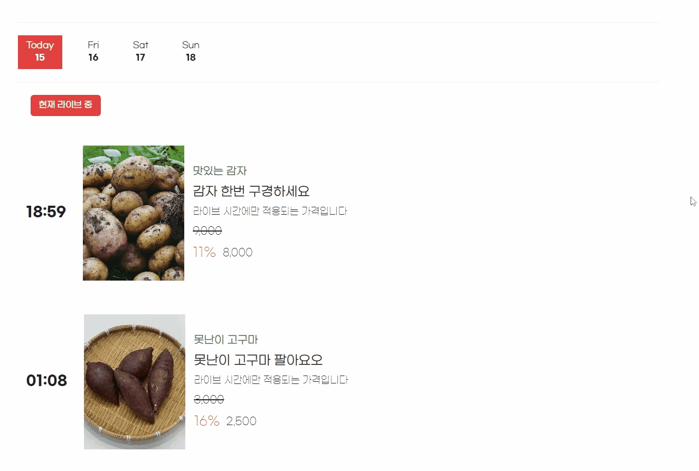
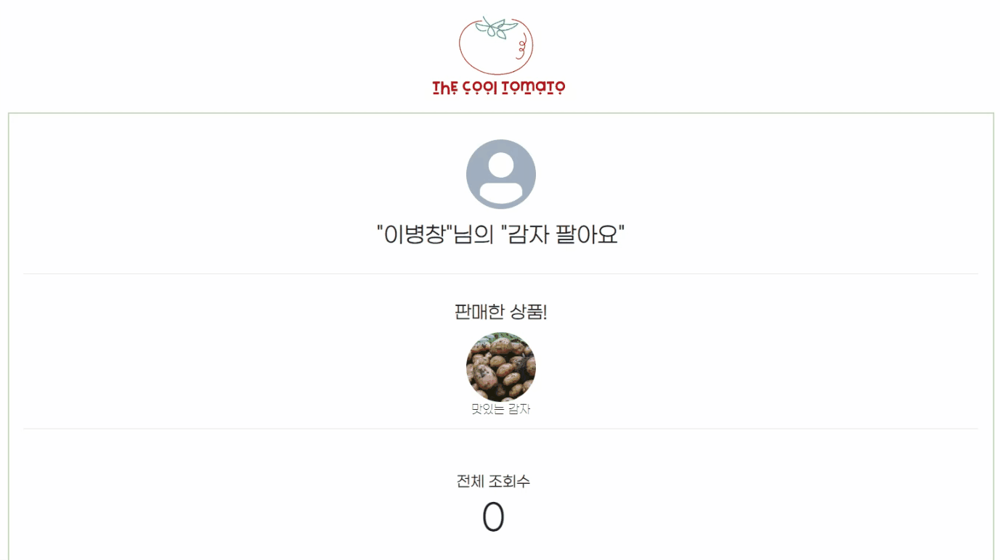

# 멋쟁이 토마토
못난이 농수산물을 위한 새로운 유통 판로, 멋쟁이 토마토

서비스 URL : https://i10a501.p.ssafy.io/v1/main

## 1. 주요 기능 & 목적



라이브 커머스에 실시간 방송 분석, 채팅, 챗봇 서비스를 더해 보다 편하게 농수산물을 판매할 수 있도록 함

## 2. 개발 환경
#### 백엔드 
- **Spring boot 3.2.1**
    
    https://start.spring.io/
- **java 17**

    https://www.oracle.com/java/technologies/javase/jdk17-archive-downloads.html
- **Kafka 3.6.0**
- **Elastic Search 7.17.18**
- **Logstash 7.10.2**
- **Kibana 7.10.2**

#### 프론트엔드
- **Node.js (up to 20.10.0)** 
    
    https://nodejs.org/en/download/
```
//package.json
"@chakra-ui/icons": "^2.1.1",
"@chakra-ui/react": "^2.8.2",
"@emotion/react": "^11.11.3",
"@emotion/styled": "^11.11.0",
"@reduxjs/toolkit": "^2.0.1",
"@stomp/stompjs": "^7.0.0",
"@types/react-router-dom": "^5.3.3",
"@types/sockjs-client": "^1.5.4",
"axios": "^1.6.5",
"chart.js": "^4.4.1",
"dayjs": "^1.11.10",
"font-awesome": "^4.7.0",
"framer-motion": "^10.18.0",
"froala-editor": "^4.1.4",
"openvidu-browser": "^2.29.1",
"react": "^18.2.0",
"react-chartjs-2": "^5.2.0",
"react-dom": "^18.2.0",
"react-froala-wysiwyg": "^4.1.4",
"react-icons": "^5.0.1",
"react-redux": "^9.1.0",
"react-router-dom": "^6.21.2",
"redux-persist": "^6.0.0",
"sockjs-client": "^1.6.1",
"stompjs": "^2.3.3"
```

### 배포 환경
- **EC2 Ubuntu 20.04.6 LTS (GNU/Linux 5.15.0-1051-aws x86_64)**
- **Spring cloud gateway 3.2.2** 
- **Srping cloud Neflix - Eureka 3.2.2**
- **Srping cloud config 3.2.2**

### DB 설정
- **mysql 8.1.0** 
    
    https://downloads.mysql.com/archives/community/
- **redis 7.2.3**
- dump 파일 위치 : 

### IDE
- **IntelliJ IDEA 2023.3.2** 
    
    https://www.jetbrains.com/ko-kr/idea/download/?section=windows
- **VisualStudio Code (up to 1.86.1)**

    https://code.visualstudio.com/Download
- **DBeaver 23.3.1** 
    
    https://dbeaver.io/download/

## 3. 프로젝트 설계
### 피그마
https://www.figma.com/file/AMgvQLyr3iSKXPtkqlp61p/%EB%AF%80%EC%A7%B8%EC%9D%B4%ED%84%B0%EB%A7%88%ED%84%B0?type=design&node-id=0%3A1&mode=design&t=AvI2KsDaySKUKA2e-1 

### API 명세
https://www.notion.so/API-4fe3d76c7fcf4d12bfd03163c551eb1b?pvs=4

### ERD 설계



## 4. 서비스 화면
### 메인


### 회원
- 로그인


- 회원가입


- 회원 정보 수정


- 판매자 프로필(팔로우, 상품)


- 구매자용 마이페이지


- 판매자용 마이페이지


- 관리자용 마이페이지(공지사항, 회원 조회, 판매자 신청 관리)


### 상품
- 상품 목록


- 상품 상세


- 상품 등록


- 구매자용 상품 문의 등록


- 판매자용 상품 문의 확인


### 라이브
- 라이브 달력


- 라이브 검색


- 라이브 등록


- 구매자용 라이브(방송, 채팅, 챗봇, 차단, 라이브 상품)


- 판매자용 라이브(방송, 채팅, 차단, 실시간 분석)


- 라이브 사후 분석


- 차단 목록, 해제


- 챗봇 설정


### 그 외 페이지


## 5. 주요 기능 소개
#### 1. 실시간 방송 분석
- 내용: 채팅 속 키워드 카운팅 및 순위 제공
- 사용 기술: Apache Storm
- 사용 이유: 다량의 채팅 데이터를 싱글 프로세스로 처리시 성능 저하
- Apache Storm의 분산/병렬 스트리밍 처리를 통한 처리 성능 향상

#### 2. 채팅(Kafka)
- 내용 : 채팅 기능 및 차단 기능으로 채팅 금지 기능 제공 
- 사용 기술 : STOMP, Kafka
- 사용 이유 : 사용자 증가 및 분석으로 인한 부하 증가, 실시간성 요구사항 충족과 고가용성 보장의 어려움
- Kafka를 통한 데이터 복제, 파티션 분산으로 부하 분산 및 고가용성 확보 
- Redis 캐싱을 통해 채팅 차단 기능 속도 향상

#### 3. 챗봇 
- 내용 : 판매자의 답변 정보로 자동응답 챗봇 제공 
- 사용 기술 : STOMP, Elastic Search, Logstash, Kibana
- 사용 이유 : 판매자가 작성한 키워드, 답변 내용을 MySQL에서 조회 시 검색 속도 저하,   
 키워드 검색 시 한국어로 필터링이 어려움
- ELK를 통해 검색 속도 향상 및 score로 필터링하여 정확도 향상
- 한국어 분석기인 nori를 사용하여 한국어 검색 내용 정확도 개선

### 6. 프로젝트 소개 UCC
 
